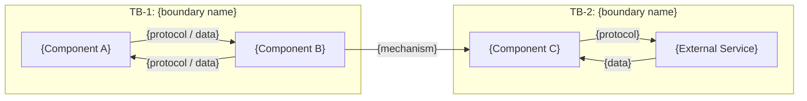
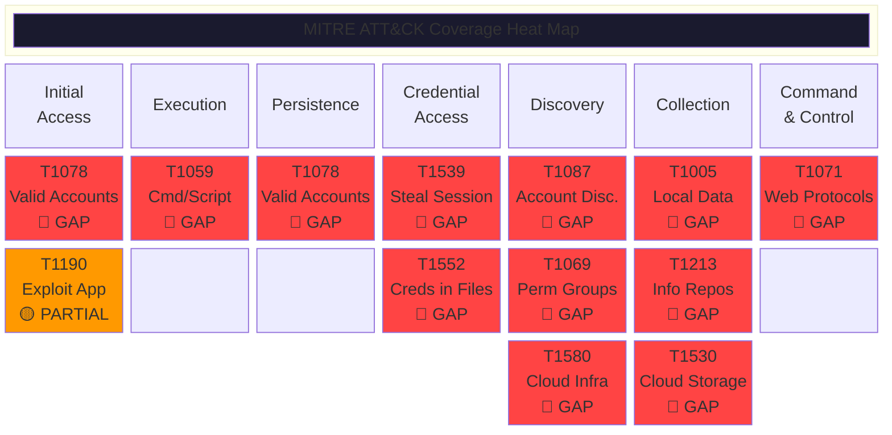
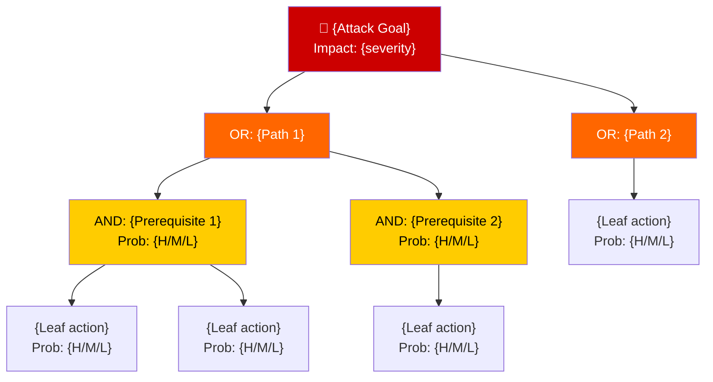
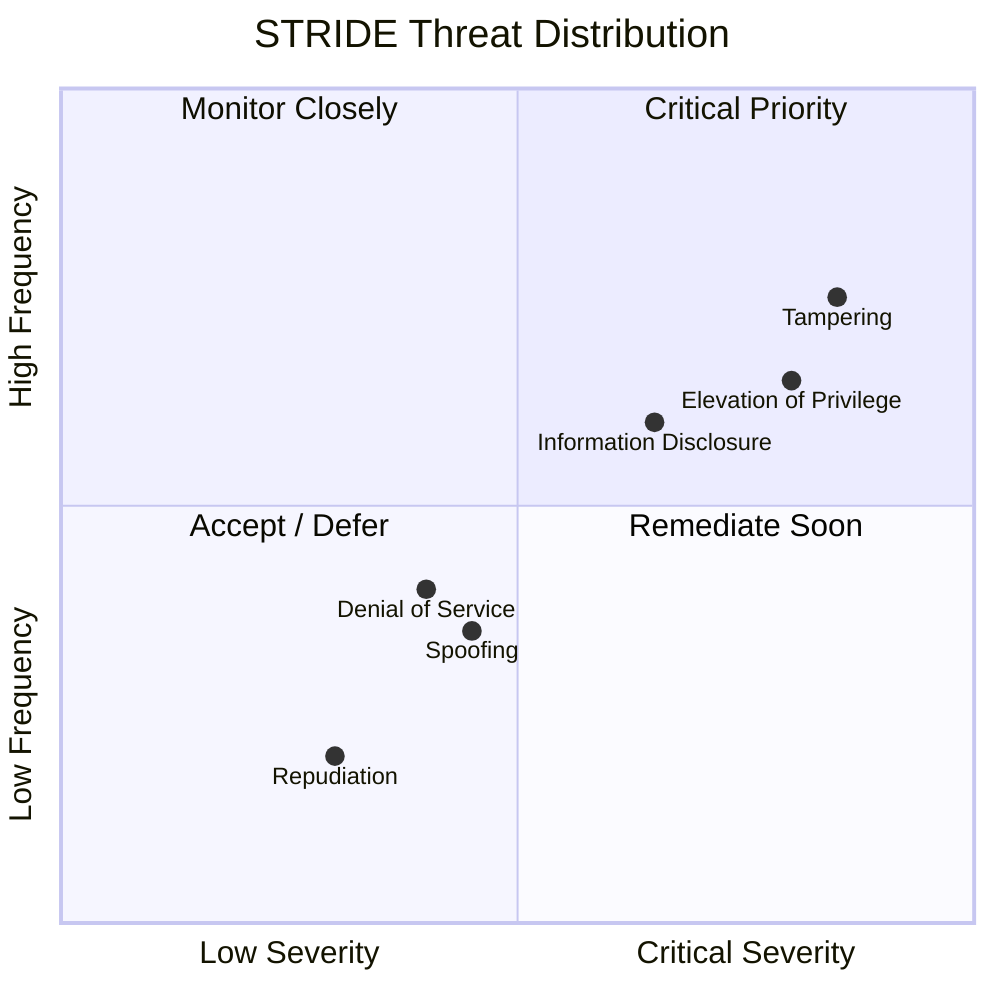

# Threat Model Template: Agentic Systems

> **Usage**: Copy this template and replace all `{PLACEHOLDER}` values.
> **Methodology**: STRIDE + MITRE ATT&CK + Attack Trees (Panel-based review)
> **Diagrams**: All diagrams MUST use Mermaid syntax.

---

# Threat Modeling Panel Report: {SYSTEM_NAME}

**Date**: {YYYY-MM-DD}
**Target**: {SYSTEM_NAME} {VERSION}
**Methodology**: STRIDE, MITRE ATT&CK, Attack Trees
**Panel**: Threat Modeling Review ({N} participants)
**Threat Posture Assessment**: **{Weak|Adequate|Strong}**

---

## Executive Summary

{2-3 paragraph summary covering: what the system does, the overall risk posture,
and the most critical systemic findings. For agentic systems, specifically address:
(1) agent privilege boundaries, (2) content/prompt integrity, (3) credential exposure,
(4) audit trail completeness.}

**Top 5 Risks**:

1. {Risk 1} ({Critical|High|Medium|Low})
2. {Risk 2} ({Critical|High|Medium|Low})
3. {Risk 3} ({Critical|High|Medium|Low})
4. {Risk 4} ({Critical|High|Medium|Low})
5. {Risk 5} ({Critical|High|Medium|Low})

---

## 1. Systems Architect: Architecture Presentation

### 1.1 Component Inventory

| Component        | Description    | Language   | Location    |
| ---------------- | -------------- | ---------- | ----------- |
| {Component Name} | {What it does} | {Language} | {File/path} |

### 1.2 External Dependencies

| Dependency   | Role   | Trust Level                                                         |
| ------------ | ------ | ------------------------------------------------------------------- |
| {Dependency} | {Role} | {External service / Third-party package / Trusted / Implicit trust} |

### 1.3 Data Flows

> **REQUIRED**: Use a Mermaid diagram showing all data flows and trust boundaries.



### 1.4 Trust Boundaries

| ID   | Boundary        | From     | To            | Protection                       |
| ---- | --------------- | -------- | ------------- | -------------------------------- |
| TB-1 | {Boundary name} | {Source} | {Destination} | {Current protection or **None**} |

### 1.5 Agentic System Specifics

> Complete this section for any system involving AI agents, MCP servers, or LLM-driven automation.

| Property                     | Value                                                          |
| ---------------------------- | -------------------------------------------------------------- |
| Agent Transport              | {stdio / HTTP / WebSocket}                                     |
| Agent Authentication         | {None / Token / mTLS / Other}                                  |
| Tool Count                   | {N tools exposed}                                              |
| Tool Authorization           | {None / Per-tool / Role-based}                                 |
| Prompt Source                | {Local / Remote / User-supplied / Mixed}                       |
| Content Integrity            | {None / Hash validation / Signatures}                          |
| Agent Privilege Level        | {Unrestricted / Scoped tools / Scoped paths / Least-privilege} |
| Credential Exposure to Agent | {List any tokens/secrets accessible to agent process}          |
| Audit Logging                | {None / Partial / Structured}                                  |

---

## 2. MITRE Analyst: Trust Boundary Crossings

### 2.1 Crossing Inventory

| #   | Source   | Destination   | Data Transferred    | Current Protections   |
| --- | -------- | ------------- | ------------------- | --------------------- |
| C-1 | {Source} | {Destination} | {What data crosses} | {Protections or None} |

---

## 3. MITRE Analyst: STRIDE Threat Catalog

> For each trust boundary crossing, enumerate threats using all six STRIDE categories.
> Rate severity as **Critical**, **High**, **Medium**, or **Low**.

### 3.1 Crossing C-1: {Source} -> {Destination}

| ID   | Category               | Threat               | Severity       |
| ---- | ---------------------- | -------------------- | -------------- |
| S-01 | Spoofing               | {Threat description} | **{Severity}** |
| T-01 | Tampering              | {Threat description} | **{Severity}** |
| R-01 | Repudiation            | {Threat description} | **{Severity}** |
| I-01 | Information Disclosure | {Threat description} | **{Severity}** |
| D-01 | Denial of Service      | {Threat description} | **{Severity}** |
| E-01 | Elevation of Privilege | {Threat description} | **{Severity}** |

{Repeat section 3.x for each crossing C-2, C-3, etc.}

### 3.N Agentic-Specific STRIDE Considerations

> Always evaluate these agentic threat patterns (adapt IDs to follow your sequence):

| ID   | Category               | Threat Pattern                                                              | Severity       |
| ---- | ---------------------- | --------------------------------------------------------------------------- | -------------- |
| {ID} | Spoofing               | Any process can impersonate the LLM agent on unauthenticated transport      | **{Severity}** |
| {ID} | Tampering              | Prompt injection via untrusted user input into agent context                | **{Severity}** |
| {ID} | Tampering              | Content poisoning via remote prompt/resource fetch without integrity check  | **{Severity}** |
| {ID} | Tampering              | Instance/endpoint redirection via unsanitized configuration parameters      | **{Severity}** |
| {ID} | Repudiation            | No logging of tool invocations, parameters, or data volumes accessed        | **{Severity}** |
| {ID} | Information Disclosure | Unrestricted access to sensitive data sources (e.g., all tables, all files) | **{Severity}** |
| {ID} | Information Disclosure | Credential/token leakage into agent process environment                     | **{Severity}** |
| {ID} | Denial of Service      | Unbounded pagination/fetch enabling resource exhaustion                     | **{Severity}** |
| {ID} | Elevation of Privilege | No tool-level authorization; all tools available to any caller              | **{Severity}** |
| {ID} | Elevation of Privilege | Agent granted `--allow-all-tools` / unrestricted filesystem access          | **{Severity}** |
| {ID} | Elevation of Privilege | GITHUB_ENV/GITHUB_PATH poisoning in CI agentic workflows                    | **{Severity}** |

---

## 4. Red Team Engineer: Attack Path Validation

> Document 5-10 concrete, narrative attack paths. Each should include:
> prerequisites, step-by-step procedure, impact, and likelihood.

### ATK-01: {Attack Name} ({Critical|High|Medium})

**Narrative**:

1. {Step-by-step attack procedure with specific file/line references}

**Prerequisites**: {What the attacker needs}
**Impact**: {What damage results}
**Likelihood**: **{High|Medium|Low}** -- {rationale}

### ATK-02: {Attack Name} ({Severity})

{Repeat pattern...}

> **Agentic systems MUST include attack paths for**:
>
> - Prompt injection → tool abuse chain
> - Bulk data exfiltration via unrestricted queries
> - Session/credential theft and replay
> - Instance/endpoint redirection
> - CI pipeline poisoning via agent-controlled inputs

---

## 5. Infrastructure Engineer: Configuration Assessment

> Assess infrastructure hardening. Include findings for:
>
> - Transport authentication
> - Session/credential storage
> - Network isolation
> - Process sandboxing
> - Environment variable exposure
> - TLS configuration
> - Exception handling

### INFRA-01: {Finding Title} ({Critical|High|Medium|Low})

**Current State**: {What exists today}
**Risk**: {Severity}
**Recommendation**: {What to do}

---

## 6. Blue Team Engineer: Detection & Response Coverage

### 6.1 Detection Coverage Matrix

| Capability                   | Status                        | Details   |
| ---------------------------- | ----------------------------- | --------- |
| Tool invocation logging      | **{Gap / Partial / Covered}** | {Details} |
| Query content logging        | **{Gap / Partial / Covered}** | {Details} |
| Data access logging          | **{Gap / Partial / Covered}** | {Details} |
| Session lifecycle logging    | **{Gap / Partial / Covered}** | {Details} |
| Authentication event logging | **{Gap / Partial / Covered}** | {Details} |
| Error/exception logging      | **{Gap / Partial / Covered}** | {Details} |
| Anomalous query detection    | **{Gap / Partial / Covered}** | {Details} |
| Rate/volume monitoring       | **{Gap / Partial / Covered}** | {Details} |

### 6.2 Alerting Gaps

- {List specific detections that are missing}

### 6.3 Incident Response Assessment

| Procedure                  | Status                                     |
| -------------------------- | ------------------------------------------ |
| Session revocation         | **{Gap / Partial / Covered}** -- {details} |
| Rogue agent containment    | **{Gap / Partial / Covered}** -- {details} |
| Data access reconstruction | **{Gap / Partial / Covered}** -- {details} |
| Forensic evidence          | **{Gap / Partial / Covered}** -- {details} |

---

## 7. Purple Team Engineer: MITRE ATT&CK Mapping

### 7.1 Technique Coverage Matrix

| Technique | Name                     | Applicability    | Detection                     | Mitigation   |
| --------- | ------------------------ | ---------------- | ----------------------------- | ------------ |
| T1078     | Valid Accounts           | {How it applies} | **{Gap / Partial / Covered}** | {Mitigation} |
| T1539     | Steal Web Session Cookie | {How it applies} | **{Gap / Partial / Covered}** | {Mitigation} |
| {TID}     | {Name}                   | {How it applies} | **{Gap / Partial / Covered}** | {Mitigation} |

> **Common techniques for agentic systems** (evaluate all):
> T1078 (Valid Accounts), T1539 (Steal Web Session Cookie), T1005 (Data from Local System),
> T1213 (Data from Information Repositories), T1071.001 (Web Protocols), T1059 (Command/Scripting),
> T1190 (Exploit Public-Facing Application), T1087 (Account Discovery), T1069 (Permission Groups),
> T1580 (Cloud Infrastructure Discovery), T1552.001 (Credentials in Files), T1557 (Adversary-in-the-Middle),
> T1530 (Data from Cloud Storage), T1195 (Supply Chain Compromise), T1114 (Email Collection)

### 7.2 ATT&CK Heat Map

> **REQUIRED**: Render as a Mermaid diagram. Color-code by coverage status.



### 7.3 ATT&CK Summary

| Tactic              | Techniques Applicable | Covered | Partial | Gap     |
| ------------------- | --------------------- | ------- | ------- | ------- |
| Initial Access      | {N}                   | {N}     | {N}     | {N}     |
| Execution           | {N}                   | {N}     | {N}     | {N}     |
| Persistence         | {N}                   | {N}     | {N}     | {N}     |
| Credential Access   | {N}                   | {N}     | {N}     | {N}     |
| Discovery           | {N}                   | {N}     | {N}     | {N}     |
| Collection          | {N}                   | {N}     | {N}     | {N}     |
| Command and Control | {N}                   | {N}     | {N}     | {N}     |
| **Total**           | **{N}**               | **{N}** | **{N}** | **{N}** |

---

## 8. Security Auditor: Vulnerability Classification

> Classify each vulnerability with CVSS 3.1 score, CWE, and OWASP category.

### VULN-01: {Vulnerability Title} ({Critical|High|Medium|Low})

**Description**: {What the vulnerability is, with specific code references}
**CVSS 3.1**: `{VECTOR_STRING}` -- **Score: {N.N}**
**CWE**: {CWE-ID} ({CWE Name})
**OWASP**: {OWASP 2021 Category}
**Component**: {file:function/line}
**Remediation**: {Specific fix}

{Repeat for each vulnerability}

---

## 9. MITRE Analyst: Threat Actor Profiles

> Define 3-5 threat actor profiles relevant to the system.

### Actor 1: {Actor Name} ({Opportunistic|Targeted})

| Attribute     | Value                                              |
| ------------- | -------------------------------------------------- |
| Type          | {External / Insider / Nation-state / Supply chain} |
| Motivation    | {Data theft / Espionage / Sabotage / Financial}    |
| Capability    | {Low / Medium / High}                              |
| Intent        | {Opportunistic / Targeted}                         |
| Opportunity   | {What access they need}                            |
| Relevant TTPs | {MITRE technique IDs}                              |
| Scenario      | {1-2 sentence attack scenario}                     |

---

## 10. MITRE Analyst: Attack Trees

> **REQUIRED**: Use Mermaid diagrams for all attack trees.
> Include at least 3 trees covering the primary attack goals.

### Attack Tree 1: {Attack Goal}



> **Agentic systems MUST include attack trees for**:
>
> 1. Data exfiltration via agent tools
> 2. Account/session compromise
> 3. Denial of service / resource exhaustion

---

## 11. Compliance Officer: Regulatory Impact Assessment

### 11.1 SOC 2 Type II

| Trust Service Criteria   | Impact                      | Details   |
| ------------------------ | --------------------------- | --------- |
| CC6.1 Logical Access     | **{Pass / Fail / Partial}** | {Details} |
| CC6.3 Access Removal     | **{Pass / Fail / Partial}** | {Details} |
| CC7.1 Monitoring         | **{Pass / Fail / Partial}** | {Details} |
| CC7.2 Incident Detection | **{Pass / Fail / Partial}** | {Details} |
| CC7.3 Incident Response  | **{Pass / Fail / Partial}** | {Details} |
| CC8.1 Change Management  | **{Pass / Fail / Partial}** | {Details} |

### 11.2 GDPR / Privacy

- **PII Accessible**: {Yes/No} -- {details}
- **Data Minimization**: **{Compliant / Violated}** -- {details}
- **Right to Access/Erasure**: **{Supported / Not supported}**
- **Data Processing Records**: **{Present / Missing}**
- **International Transfer**: {Assessment}
- **DPIA Required**: {Yes/No} -- {rationale}

### 11.3 NIST 800-53

| Control Family               | Relevant Controls       | Status                              |
| ---------------------------- | ----------------------- | ----------------------------------- |
| AC (Access Control)          | AC-3, AC-6              | **{Met / Not Met / Partially Met}** |
| AU (Audit)                   | AU-2, AU-3, AU-6, AU-12 | **{Met / Not Met / Partially Met}** |
| IA (Identification & Auth)   | IA-2, IA-5              | **{Met / Not Met / Partially Met}** |
| SC (System & Comms)          | SC-8, SC-13, SC-28      | **{Met / Not Met / Partially Met}** |
| SI (System & Info Integrity) | SI-4, SI-10, SI-11      | **{Met / Not Met / Partially Met}** |
| CM (Config Management)       | CM-7                    | **{Met / Not Met / Partially Met}** |

### 11.4 Risk Acceptance Required

{List residual risks requiring formal acceptance by a risk owner.}

---

## 12. Prioritized Threat Register

| Rank | Vuln ID  | Threat   | CVSS    | Likelihood | Impact                  | Risk Rating                 |
| ---- | -------- | -------- | ------- | ---------- | ----------------------- | --------------------------- |
| 1    | VULN-{N} | {Threat} | {Score} | {H/M/L}    | {Critical/High/Med/Low} | **{Critical/High/Med/Low}** |

---

## 13. Mitigation Roadmap

### Phase 1: Critical (Immediate -- 0-2 weeks)

| #    | Mitigation | Addresses | Owner  |
| ---- | ---------- | --------- | ------ |
| M-01 | {Action}   | VULN-{N}  | {Team} |

### Phase 2: High Priority (Next Sprint -- 2-8 weeks)

| #     | Mitigation | Addresses | Owner  |
| ----- | ---------- | --------- | ------ |
| M-{N} | {Action}   | VULN-{N}  | {Team} |

### Phase 3: Medium Priority (Next Quarter -- 1-3 months)

| #     | Mitigation | Addresses | Owner  |
| ----- | ---------- | --------- | ------ |
| M-{N} | {Action}   | VULN-{N}  | {Team} |

### Phase 4: Long-term Hardening

| #     | Mitigation | Addresses | Owner  |
| ----- | ---------- | --------- | ------ |
| M-{N} | {Action}   | VULN-{N}  | {Team} |

---

## 14. Residual Risk Summary (After Proposed Mitigations)

| Risk Area           | Before     | After Phase 1       | After Phase 2  | After All    |
| ------------------- | ---------- | ------------------- | -------------- | ------------ |
| {Risk area}         | {Rating}   | {Rating}            | {Rating}       | {Rating}     |
| **Overall Posture** | **{Weak}** | **{Weak/Adequate}** | **{Adequate}** | **{Strong}** |

---

## 15. Threat Posture Assessment: **{WEAK|ADEQUATE|STRONG}**

{Final assessment paragraph summarizing readiness for production deployment.}

---

## Appendix A: STRIDE Risk Heat Map

> **REQUIRED**: Mermaid diagram showing threat density by STRIDE category and severity.



> Adjust coordinates based on actual findings. X = severity (0=Low, 1=Critical), Y = frequency.

## Appendix B: Sigma Detection Rules

> Define detection rules for deployment once structured logging is implemented.

### Rule 1: {Detection Name}

```yaml
title: {System} - {Detection Description}
id: {unique-id}
status: experimental
description: {What it detects}
logsource:
    product: {system-name}
    service: tool_invocation
detection:
    selection:
        tool_name: {tool}
        {field}|contains:
            - '{value}'
    condition: selection
level: {high|medium|low|critical}
```

## Appendix C: Purple Team Validation Exercises

| Exercise | ATT&CK Technique | Procedure    | Expected Detection |
| -------- | ---------------- | ------------ | ------------------ |
| PT-01    | {TID}            | {What to do} | {What should fire} |

---

## Panel Methodology

### Moderator Hierarchy

| Role                   | Responsibility                                                                                                                                |
| ---------------------- | --------------------------------------------------------------------------------------------------------------------------------------------- |
| **Overall Moderator**  | Coordinates all 5 sub-moderators; cross-domain deduplication, compound attack chain construction, severity arbitration, final report assembly |
| **Sub-Moderator (×5)** | Leads one review track; aggregates within their domain; escalates cross-cutting concerns; enforces risk validation                            |

### Review Tracks (All 5 Run in Parallel)

| Track | Sub-Moderator Persona                   | Specialist Reviewers                       |
| ----- | --------------------------------------- | ------------------------------------------ |
| 1     | **Infrastructure Security Engineer**    | Systems Architect, Infrastructure Engineer |
| 2     | **Supply Chain Security Specialist**    | MITRE Analyst (ATT&CK), Security Auditor   |
| 3     | **Application Security Engineer**       | MITRE Analyst (STRIDE), Red Team Engineer  |
| 4     | **DevSecOps & AI Safety Engineer**      | Purple Team Engineer, Blue Team Engineer   |
| 5     | **Data Privacy & Information Security** | Compliance Officer, Security Auditor       |

### Parallel Process

1. **Phase 1 — Parallel Analysis**: All 5 tracks execute simultaneously; each sub-moderator coordinates their reviewers to analyze architecture, trust boundaries, and code
2. **Phase 2 — Per-Track Aggregation**: Each sub-moderator deduplicates, ranks, and flags cross-domain findings
3. **Phase 3 — Overall Moderator Integration**: Cross-references all tracks; identifies convergent findings, compound attack chains, and coverage gaps
4. **Phase 4 — 5 Hardening Rounds**: Sub-moderators challenge each other's findings iteratively; Overall Moderator arbitrates severity and validates mitigations
5. **Phase 5 — Final Report Assembly**: Overall Moderator produces the integrated report with cross-track consensus and dissenting opinions

---

*Report generated by Threat Modeling Panel per parallel panel methodology.*
*Overall Moderator: {name/role}*
*Sub-Moderators: {list all 5 track leads}*
*Participants: {list all specialist reviewers that contributed}*
